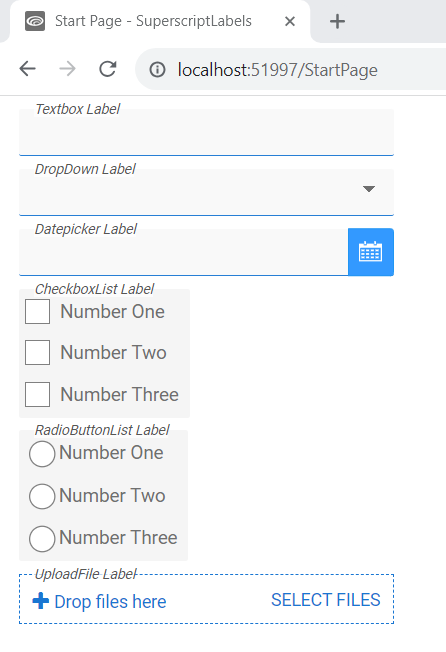
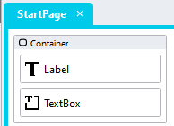

# Superscript Labels

When vertical space is at a problem, you can use this module to display a field label in Superscript above the field. 



## Version 
1.0 - initial

# Setup

## Application Setup
1. Check the *Enable Style Sheet* checkbox in the application properties

## Page Setup
1. Drag a *Container* control into the page 
2. Add a class called "stadium-superscript-label" into the *Container* classes property
3. Drag a *Label* control into the *Container* control
4. Add the text you wish to show on the label into the text property
5. Drag a *CheckBoxList*, *DatePicker*, *DropDown*, *RadioButtonList*, *Textbox* or *UploadFile* control into the *Container* control



## Applying the CSS
The CSS below is required for the correct functioning of the module. Some elements can be [customised](#customising-css) using a variables CSS file. 

**Stadium 6.6 or higher**
1. Create a folder called "CSS" inside of your Embedded Files in your application
2. Drag the two CSS files from this repo [*superscript-label-variables.css*](superscript-label-variables.css) and [*superscript-label.css*](superscript-label.css) into that folder
3. Paste the link tags below into the *head* property of your application
```html
<link rel="stylesheet" href="{EmbeddedFiles}/CSS/superscript-label.css">
<link rel="stylesheet" href="{EmbeddedFiles}/CSS/superscript-label-variables.css">
``` 

**Versions lower than 6.6**
1. Copy the CSS from the two css files into the Stylesheet in your application

## Customising CSS
1. Open the CSS file called [*superscript-label-variables.css*](superscript-label-variables.css) from this repo
2. Adjust the variables in the *:root* element as you see fit
3. Overwrite the file in the CSS folder of your application with the customised file

## CSS Upgrading
To upgrade the CSS in this module, follow the [steps outlined in this repo](https://github.com/stadium-software/samples-upgrading)
